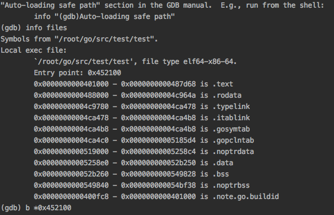

# go 汇编

##  编译一个最简单的go执行程序

```
package main

import  "fmt"

func main(){
        fmt.Println("helloworld")
}

```

go build -gcflags "-N -l" test.go 


## 使用go tool objdump 反汇编

go tool objdump test >[test.asm](github.com/myonlyzzy/post/go_asm/test/test.asm) 

gdb test



我们看到汇编的入口地址位于0x452100,打开test.asm

```
TEXT _rt0_amd64_linux(SB) /usr/local/go/src/runtime/rt0_linux_amd64.s
  rt0_linux_amd64.s:8	0x452100		488d742408		LEAQ 0x8(SP), SI	
  rt0_linux_amd64.s:9	0x452105		488b3c24		MOVQ 0(SP), DI		
  rt0_linux_amd64.s:10	0x452109		488d0510000000		LEAQ 0x10(IP), AX	
  rt0_linux_amd64.s:11	0x452110		ffe0			JMP AX			

```

可以看到入口为rto_linux_amd64.s (当然了不同平台的入口文件肯定不一样),

## rto_linux_amd64.s

```
#include "textflag.h"

TEXT _rt0_amd64_linux(SB),NOSPLIT,$-8
   LEAQ   8(SP), SI // argv
   MOVQ   0(SP), DI // argc
   MOVQ   $main(SB), AX
   JMP    AX

// When building with -buildmode=c-shared, this symbol is called when the shared
// library is loaded.
// Note: This function calls external C code, which might required 16-byte stack
// alignment after cmd/internal/obj applies its transformations.
TEXT _rt0_amd64_linux_lib(SB),NOSPLIT,$0x50
   MOVQ   SP, AX
   ANDQ   $-16, SP
   MOVQ   BX, 0x10(SP)
   MOVQ   BP, 0x18(SP)
   MOVQ   R12, 0x20(SP)
   MOVQ   R13, 0x28(SP)
   MOVQ   R14, 0x30(SP)
   MOVQ   R15, 0x38(SP)
   MOVQ   AX, 0x40(SP)

   MOVQ   DI, _rt0_amd64_linux_lib_argc<>(SB)
   MOVQ   SI, _rt0_amd64_linux_lib_argv<>(SB)

   // Synchronous initialization.
   MOVQ   $runtime·libpreinit(SB), AX
   CALL   AX

   // Create a new thread to do the runtime initialization and return.
   MOVQ   _cgo_sys_thread_create(SB), AX
   TESTQ  AX, AX
   JZ nocgo
   MOVQ   $_rt0_amd64_linux_lib_go(SB), DI
   MOVQ   $0, SI
   CALL   AX
   JMP    restore

nocgo:
   MOVQ   $8388608, 0(SP)                    // stacksize
   MOVQ   $_rt0_amd64_linux_lib_go(SB), AX
   MOVQ   AX, 8(SP)                          // fn
   MOVQ   $runtime·newosproc0(SB), AX
   CALL   AX

restore:
   MOVQ   0x10(SP), BX
   MOVQ   0x18(SP), BP
   MOVQ   0x20(SP), R12
   MOVQ   0x28(SP), R13
   MOVQ   0x30(SP), R14
   MOVQ   0x38(SP), R15
   MOVQ   0x40(SP), SP
   RET

TEXT _rt0_amd64_linux_lib_go(SB),NOSPLIT,$0
   MOVQ   _rt0_amd64_linux_lib_argc<>(SB), DI
   MOVQ   _rt0_amd64_linux_lib_argv<>(SB), SI
   MOVQ   $runtime·rt0_go(SB), AX
   JMP    AX

DATA _rt0_amd64_linux_lib_argc<>(SB)/8, $0
GLOBL _rt0_amd64_linux_lib_argc<>(SB),NOPTR, $8
DATA _rt0_amd64_linux_lib_argv<>(SB)/8, $0
GLOBL _rt0_amd64_linux_lib_argv<>(SB),NOPTR, $8

TEXT main(SB),NOSPLIT,$-8
   MOVQ   $runtime·rt0_go(SB), AX
   JMP    AX
```

上面的是go1.9.2 的rto_linux_amd64.s 文件内容.

但是我对汇编完全是半懂,只能半看半猜了,更何况这种go的汇编指令有些以前都没有看到过.好在有伟大的google,另外gdb里面的汇编单步调试提供了很多方便。

```
TEXT rt0amd64_linux(SB),NOSPLIT,$-8

   LEAQ   8(SP), SI // argv

   MOVQ   0(SP), DI // argc

   MOVQ   $main(SB), AX

   JMP    AX
   
TEXT main(SB),NOSPLIT,$-8

   MOVQ   $runtime·rt0_go(SB), AX

   JMP    AX

```


这是rto_linux_asm64.s 的前几行,第4行跳到了main(SB)这里. main(SB)有跳到了runtime·rt0_go(SB) 但是runtime·rt0_go(SB)在那里呢。这里有2种方式可以找到,一种我们可以搜索runtime 目录下的所有汇编文件。另外一种方式是使用gdb的汇编单步调试看它跳到那里

这是使用gdb单步调试的内容,关于gdb汇编单步调试就2指令ni si.

```
Breakpoint 1, _rt0_amd64_linux () at /usr/local/go/src/runtime/rt0_linux_amd64.s:8
8               LEAQ    8(SP), SI // argv
(gdb) ni
9               MOVQ    0(SP), DI // argc
(gdb) ni

Breakpoint 2, _rt0_amd64_linux () at /usr/local/go/src/runtime/rt0_linux_amd64.s:10
10              MOVQ    $main(SB), AX
(gdb) ni
11              JMP     AX
(gdb) ni
Stopped due to shared library event
(gdb) si
74              JMP     AX
(gdb) si
runtime.rt0_go () at /usr/local/go/src/runtime/asm_amd64.s:12
12              MOVQ    DI, AX          // argc
(gdb) ni
13              MOVQ    SI, BX          // argv
(gdb) 

```

我们看到是跳到了asm_amd64.s:12的12行执行,这里的代码我们可以通过旁边的注释大概了解做了什么事情

```
	// create istack out of the given (operating system) stack.
	// _cgo_init may update stackguard.
	MOVQ	$runtime·g0(SB), DI
	LEAQ	(-64*1024+104)(SP), BX
	MOVQ	BX, g_stackguard0(DI)
	MOVQ	BX, g_stackguard1(DI)
	MOVQ	BX, (g_stack+stack_lo)(DI)
	MOVQ	SP, (g_stack+stack_hi)(DI)

	// find out information about the processor we're on
	MOVL	$0, AX
	CPUID
	MOVL	AX, SI
	CMPL	AX, $0
	JE	nocpuinfo
	
	
	MOVL	16(SP), AX		// copy argc
	MOVL	AX, 0(SP)
	MOVQ	24(SP), AX		// copy argv
	MOVQ	AX, 8(SP)
	CALL	runtime·args(SB)
	CALL	runtime·osinit(SB)
	CALL	runtime·schedinit(SB)
```

主要就是获取初始化的一些事情，包括runtime.osinit runtime.schedinit 等.

```
	// create a new goroutine to start program
	MOVQ	$runtime·mainPC(SB), AX		// entry
	PUSHQ	AX
	PUSHQ	$0			// arg size
	CALL	runtime·newproc(SB)
	POPQ	AX
	POPQ	AX
```

这里把main函数入栈,然后调用newproc创建协程.

## 小结 

这篇主要介绍了使用go tool he gdb简单的分析golang程序的启动引导过程,一些细节例如 newproc和mstart 在后面的文章中介绍.

